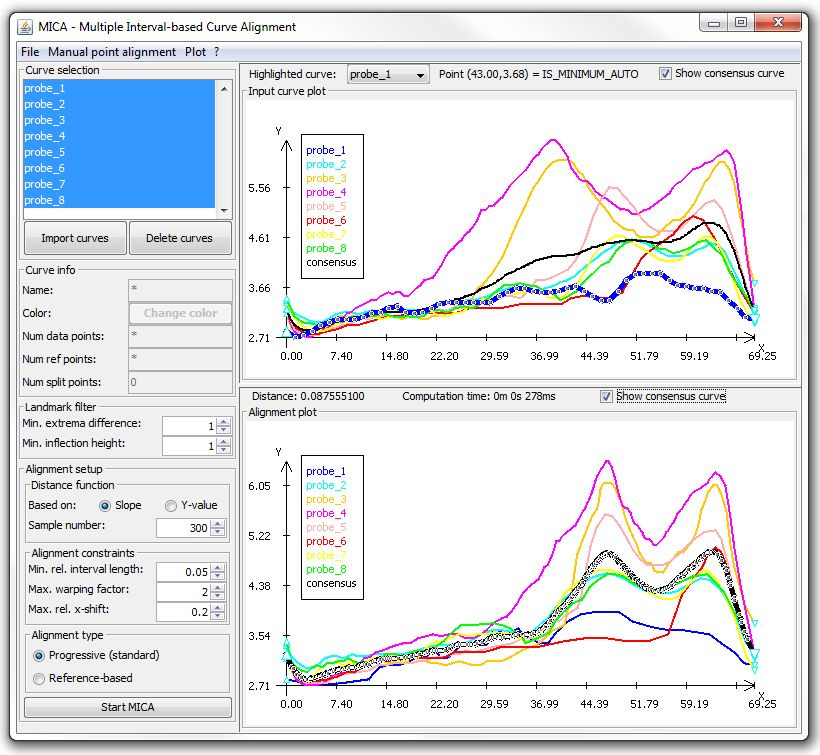
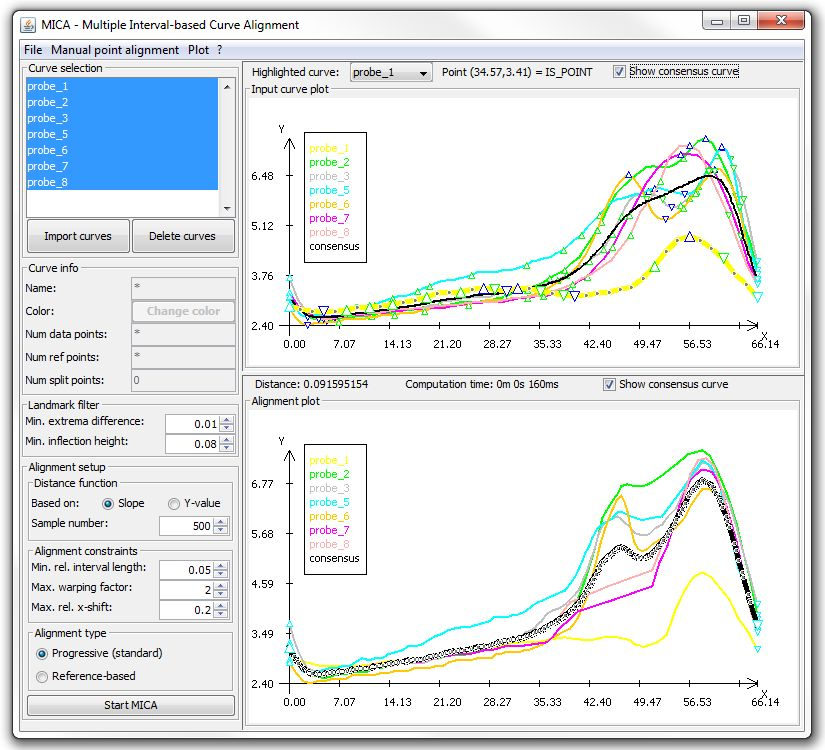

<a name="MICA" />

# MICA - Multiple Interval-based Curve Alignment [](https://github.com/BackofenLab/MICA/releases)

MICA implements a heuristic landmark registration method in combination with a
progressive alignment scheme to generate multiple curve alignments and according
representative consensus data.

==> Jump directly to [Installation and Usage](#installation) if needed...

The input is a set of discrete time series of e.g. measured data. MICA assumes that
the time series are based on a common event such that start and end time are to be mapped
and a global alignment (of the whole time series) is to be computed. To this end,
MICA identifies prominent features of each curve (like minima, maxima, and inflection points)
that are considered as alignable landmarks. To reduce computational complexity and to
reduce noise, landmarks can be filtered. The filtered subset is than used in a greedy
local optimization scheme. Therein, for two curves a pair of landmarks identified that
(i) can be mapped (same type), (ii) their mapping (and according curve distortion) 
yields the best (local) score change possible for all such pairs (local optimal decision), 
and (iii) this score is lower than doing no mapping at all.
This local optimal landmark mapping is fixed and decomposes the two curves in two respective
sub-curves left and right of the mapped landmarks. For each such sub-problem the procedure
is repeated until an interval can not be decomposed any further. The mapping of landmarks,
which is a shift in according x/time-coordinates, is transfered the all other data points 
via linear interpolation.

To align multiple curves, a progressive scheme is applied that operates on groups of curves. 
Initially, each group consists of one of the input curves. A group is represented by a
derived consensus curves computed as the arithmetic mean of all enclosed curves. Iteratively,
the pair of groups with minimal score of their respective consensus curve alignments are
selected. The consensus curve alignment provides the information how the according groups' 
curves have to be warped in order to get fused into a new group (while the original groups
are discarded). This is repeated until only one group is left, which represents the alignment
of all curves. The according consensus curve yields thus the representative consensus curve
for the input.


#### Publications using MICA

- [Microstructure alignment of wood density profiles: an approach to equalize radial differences in growth rate](http://dx.doi.org/10.1007/s00468-012-0702-y). 
  Bela Bender, Martin Mann, Rolf Backofen, and Heinrich Spiecker.
  Trees - Structure and Function, 26 no. 4 pp. 1267-1274, 2012.
  DOI: 10.1007/s00468-012-0702-y

- [Spatiotemporal alignment of radial tracheid diameter profiles of submontane norway spruce](http://dx.doi.org/10.1016/j.dendro.2015.12.001). 
  Dominik F. Stangler, Martin Mann, Hans-Peter Kahle, Elena Rosskopf, Siegfried Fink, and Heinrich Spiecker.
  Dendrochronologia, 37 pp. 33-45, 2016.
  DOI: 10.1016/j.dendro.2015.12.001


<br /><br /><br /><br />
## Overview

- [Introduction](#MICA)
- [Dependencies](#dependencies)
- [Installation](#installation) from [release page](https://github.com/BackofenLab/MICA/releases)
- [Example data sets](#data)
- [Graphical user interface](#GUI)
- [R interface](#RI)
- [Command line interface](#CLI)


<br /><br /><br /><br />
## Dependencies

- MICA tool :
  - Java-8 e.g. from [Oracle](http://www.oracle.com/technetwork/java/javase/downloads/index.html)
- MICA `R`-interface :
  - Java-8 e.g. from [Oracle](http://www.oracle.com/technetwork/java/javase/downloads/index.html)
  - `R` (tested with version 3.3.0)
  - [`rJava`](https://www.rforge.net/rJava/) - `R` package to interface Java runtime (tested with version 0.9-8)
  
Required non-standard Java libraries are either included within the JAR file or part of the provided packages.


<br /><br /><br /><br />
## Installation

To use MICA's
[Graphical user](#GUI) or 
[Command line interface](#CLI), 
you only have to download the precompiled Java file `mica.jar` from the 
[release page](https://github.com/BackofenLab/MICA/releases).

Given Java is correctly installed, you only have to either double-click on `mica.jar` to open the GUI
or to run `java -jar mica.jar` within a command prompt/terminal.

For details how to use MICA within R, please refer to the [R interface](#RI) description.

When you are interested in compiling MICA yourself either

- clone the git repository (master branch) or
- download the source archive of the according version from the [release page](https://github.com/BackofenLab/MICA/releases)

For compilation, you have to extend your build library path with the 
provided `lib` subfolder and the included `.jar` files of the libraries 
that are required to build and run MICA. 
A possible compilation and starting call (tested with Oracle JDK 1.8.0) is given below.

```[bash]
# change to 'src' directory
cd src
# compile MICA from source
javac -cp ".;../lib/commons-lang3-3.4.jar;../lib/commons-math3-3.6.1.jar;../lib/java-hamcrest-2.0.0.0.jar;../lib/jopt-simple-5.0.2.jar" de/uni_freiburg/bioinf/mica/controller/MicaMain.java
# start MICA GUI from shell
java -cp ".;../lib/commons-lang3-3.4.jar;../lib/commons-math3-3.6.1.jar;../lib/java-hamcrest-2.0.0.0.jar;../lib/jopt-simple-5.0.2.jar" de.uni_freiburg.bioinf.mica.controller.MicaMain
```


<a name="data" />

<br /><br /><br /><br />
## Example data sets

In order to ease the initial testing of MICA, we provide the following example data sets.
You can directly load the CSV files with MICA and investigate the effects of different parameterizations etc.

#### HF-density-2000 [csv](data/HF-density-2000.csv):

This probe contains intra-anual wood density data of a Douglas-fir tree ring 
(Pseudotsuga menziesii [Mirb.] Franco) grown in southwestern Germany in the year 2000.
The density was equidistantly measured in 8 radial directions and shows the variations of tree growth along the circumference of a tree.
To derive a representative consensus profile that well reflects all measured profiles, a prior alignment of the curves is needed, which can be done with MICA.

This example very well demonstrates the need of alignment when deriving a representative consensus profile.
The consensus of the length-normalized input curves only shows a single peak while all input curves show two significant peaks. Thus the common signal (2 peaks) is completely lost.
In contrast, the representative consensus of the MICA aligned curves features both peaks.

[](data/HF-density-2000.jpg?raw=true "MICA for HF-density-2000")


#### HF-density-1976 [csv](data/HF-density-1976.csv):

This probe contains intra-anual wood density data of a Douglas-fir tree ring 
(Pseudotsuga menziesii [Mirb.] Franco) grown in southwestern Germany in the year 1976.
The density was equidistantly measured in 7 radial directions and shows the variations of tree growth along the circumference of a tree.
To derive a representative consensus profile that well reflects all measured profiles, a prior alignment of the curves is needed, which can be done with MICA.

This data set shows a transition of the curves' characteristics from a single major peak to a two-peak shape, which is lost in the initial consensus of the length-normalized curves.
However, MICA's progressive alignment scheme is able to align the curves such that the resulting representative consensus shows the two-peak characteristic.

[](data/HF-density-1976.jpg?raw=true "MICA for HF-density-1976")


#### HF-density-1989-outlier [csv](data/HF-density-1989.csv):

This probe contains intra-anual wood density data of a Douglas-fir tree ring 
(Pseudotsuga menziesii [Mirb.] Franco) grown in southwestern Germany in the year 1989.
The density was equidistantly measured in 8 radial directions and shows the variations of tree growth along the circumference of a tree.
To derive a representative consensus profile that well reflects all measured profiles, a prior alignment of the curves is needed, which can be done with MICA.

One of the profiles (probe_8) shows a strong outlier characteristic, which complicates its alignment to the remaining data set. 
Depending on the parameterization, this strongly influences the final shape of the overall representative consensus profile, as you can see when loading into MICA.


<a name="GUI" />

<br /><br /><br /><br />
## Graphical user interface

The graphical user interface (GUI) is organized in three parts (see Figure below). On the left, 
curve data can be loaded, respective information like names or color can be altered, and the parameter setup
for landmark filtering and MICA alignment computation is possible. 
The (sub)set of selected curves (upper left corner) is printed in the upper right part of the
window. Each curve is represented by its according color. After the computation of a
curve alignment (start button on the lower left), the aligned curves are depicted in the
lower right part of the GUI. In the following, the individual parts and possible settings
are detailed while following a typical MICA workflow.


(Snapshot for example data set [data/HF-density-1976.csv](data/HF-density-1976.csv))

<a name="MICAinput" />

### Import/loading of curve data

The MICA GUI currently supports only the import of equidistant curve data, 
i.e. the difference between successive x-coordinates is equal between all
data points. Thus, their distance is assumed to be 1. Furthermore, the 
first x-coordinate is set to 0. We are currently working on the import of
explicit x-coordinate data for the GUI. Full data point support is e.g. available
via the [R interface](#RI).
The y-values for all curves are to be encoded columns-wise.

Curve data can be loaded in CSV format (one curve per column, see 
[example files](#data) within the [data](https://github.com/BackofenLab/MICA/data) subfolder) either

- use the `File` submenu `Import curve`, or
- double-click at the `Curve selection` field in the upper left corner, or
- use the `Import curves` button below the selection.

All open a file dialog to select a CSV file to import data from.
After file selection, an import preview dialog is opened. Therein, CSV
specific parameters can be set, i.e.

- whether or not column names (header information) is present, and
- the field/column separator character to be used.

As soon as the setup enables a parsing of the file, an according preview is
presented to the user. An example is given below.


Here, the user can (de)select the column to be imported (checkbox in each column header).
Furthermore, it is possible to automatically interpolate the data to a given number 
of equidistant x-coordinates (checkbox "Enable len. corr." and according number of data 
points in the field above). The y-value for the interpolated x-coordinates are derived
via linear interpolation between the nearest enclosing original data points.

After using the `Import` button, the curves are loaded and directly depicted
in the input plot area in the upper right of the GUI.


### Inspection of curves to be aligned

The interaction curve depiction in the upper right of the GUI represents

- the curves' data points
- the annotated and filtered landmarks (and their types)
- details to selected points (upper information bar)
- a drop-down selection of the highlighted curve (upper information bar)

The highlighted curve (bold and all points represented) can be selected using the
drop-down button in the upper information bar. Here, highlighting can also be disabled.

The position of the legend box can be changed using the `Plot` menu from the menu bar.

Using left mouse-click in the plot region selects the data point with an x-coordinate
closest to the mouse position. Detailed point information like x,y coordinates and 
annotation type are shown in the upper information bar.

To reduce the number of depicted curves, select an according subset from within the 
`Curve selection` list on the upper left of the GUI. Using the (pressed) `Ctrl`-key together with
the mouse enables multi-selections.

When single curves are selected, curve details like name, color, number of data 
points etc. are visualized on the left within the `Curve information` area. 
Here it is also possible to change some properties.

The checkbox `Show consensus curve` within the upper information bar enables the
generation and representation of a mean consensus profile of the input curves (after
length normalization of all curves).

The curve depiction is interactive, i.e. you can:

- zoom in/out by holding down the `Ctrl` key in combination with the mouse wheel 
  (zoom factor is shown in the upper right corner if < 100%)
- select individual points of the currently highlighted curve (see selection dropdown); 
  the selected point is highlighted and according information is provided in the upper information bar 
- drag the visualized area left/right (when zoomed in) by click+drag with the left mouse button
- scroll left/right (when zoomed in) with the mouse wheel


<a name="manualSplit" />

### Manual pre-alignment

The MICA GUI offers the option to manually pre-align certain positions of the input curves
before starting the overall alignment optimization via MICA. This is intended to incorporate
human expert knowledge into the alignment process e.g. to guide difficult or ambiguous 
situations.

In order to add a pre-alignment, select
`Add manual point alignment` from the `Manual point alignment` menu. This will successively
request the selection of a point to be aligned for each curve individually. These manual
alignment points are directly visualized in the input curves and will be already aligned
when `Show consensus curve` is enabled for the input visualization (see above).

Repeat this procedure if multiple positions are to be pre-aligned. Note, the marked points are
aligned in x-coordinate order and *not* in input order. This is done to maintain the monotonicity
of the alignment.


<a name="landmarkFiltering" />

### Landmark filtering

The `Landmark filter` on the left allow to tune the filtering of the landmarks for
*all* curves. Value changes are directly applied and the input curve representation
on the upper right is instantly updated.

*Extrema* (minima and maxima of the curves' y-coordinates) can be filter using the
`Min. extrema difference` value. This value restricts the minimally allowed relative
y-difference of an extremum to its neighbored extrema. The difference is normalized by
the overall y-range of the curve. For filtering, the relative difference of all successive
extrema of different type (max/min) is computed. The smallest difference below the
threshold is identified and *both* extrema are removed from the list of available
landmarks. Removing both is needed to preserve the alternation of extrema of different
type. Furthermore, included inflection points are removed too. This procedure is
repeated until the smallest relative extrema difference is above the threshold. This 
filter is very useful to remove extrema annotations due to low amplitude noise.
To remove all extrema from the landmark list, set the threshold to 1.

*Inflection points* are filtered based on their relative slope. Given the `Min. 
inflection height` value, all inflection points are removed from the available
landmark list that show a normalized absolute slope value smaller than the given
threshold. The normalization is done by the largest absolute slope value present
within a curve. To remove all inflection points from the landmark list, set the
threshold to 1.

Larger numbers of landmarks result in longer runtimes of MICA, since all landmarks
are potential alignment coordinates. Thus, it is useful to tune the filtering 
parameters to gain (for most curves) a reasonably small selection of 
extrema and inflection points for the alignment.


<a name="MICAparams" />

### Alignment parameters and constraints

The `Alignment setup` section defines the parameterization of the MICA workflow.

The `Distance function` defines what measure is to minimized by the alignment procedure.
All measures are applied to the given `Sample number` of equidistance x-coordinates.
It is either possible to minimize the mean absolute difference of slope or y-coordinate 
values. Slope value differences are insensitive to "y-shifts" of the curves.

`Alignment constraints` are used to restrict the distortion of the curves when aligned.
The more rigid the constraints, the smaller are the effects of the alignment. Too relaxed
constraints, on the other hand, might yield too drastic warping and thus alignment artifacts.
In the following, we will detail the constraint available within the GUI:

- `Min. rel. interval length` restricts the minimal length of an interval to be considered
  for further decomposition. The value defines the minimal relative length, i.e. it has to 
  hold `(length/curveLength) >= value`.
- `Max. warping factor` constrains the maximally allowed length distortion of an interval, 
  i.e. it has to hold `max{newLength/oldLength, oldLength/newLength} <= value`.
- `Max. rel. x-shift` restricts how far an x-coordinate can be shifted, i.e. it has to hold
  `(abs(oldX-newX)/curveLength) <= value`. 

Finally, the `Alignment type` defines whether a `Progressive` alignment is to be done, i.e.
all curves are aligned to each other as best as possible, or if a `Reference-based` alignment
is to be created. The latter requires the selection which curve is to be considered as
fixed reference, which is done via an according dialog after using the `Start MICA` button.
Reference-based alignment fits all curves as best as possible to the given reference, while
the reference curve is not warped at all and considered fixed.


### Starting alignment computation and its visualization

The `Start MICA` button triggers the MICA computation for all curves and the given parameterization.
A status dialog with abort option is shown while the computation is running.

After completion, the computed alignment is depicted in the lower right part of the GUI. 
It is accompanied with the final distance score and the computation time (upper information bar).
It is possible to deactivate the visualization of the representative consensus curve via the
according checkbox `Show consensus curve` within the upper information bar.

The alignment visualization is interactive, i.e. you can:
- zoom in/out by holding down the `Ctrl` key in combination with the mouse wheel 
  (zoom factor is shown in the upper right corner if < 100%)
- drag the visualized area left/right (when zoomed in) by click+drag with the left mouse button
- scroll left/right (when zoomed in) with the mouse wheel

The position of the legend is also controlled by the `Plot` menu as for the input curve depiction.


### Input/Output file export

The MICA GUI offers the export of both input as well as alignment data in different formats.
Exports are available via the `File` menu and detailed below.


#### Export CSV

Select this menu to export input/output/consensus data in CSV format. The data to be exported
can be selected via an according dialog as shown below.
After selection, the target file has to be specified via the subsequent file dialog.


#### Export PNG

To export an image of the visualized curves, you can use the PNG export menu. First, you have to
chose the resolution/size of the image to be created via the dialog shown below.
After selection, the target file has to be specified via the subsequent file dialog.


<a name="RI" />

<br /><br /><br /><br />
## R interface

To use MICA from within `R`, the following steps are necessary:

- install on your machine JRE or JDK version 8 or higher (Java SE Development Kit) e.g. from [Oracle](http://www.oracle.com/technetwork/java/javase/downloads/index.html)
- install [`rJava`](https://www.rforge.net/rJava/) (e.g. using `install.packages("rJava");` within `R`)
- note: `rJava-0.9-8` does not identify the installed Java runtime correctly/automatically on Windows! Here the following additional steps are needed:
   - add the path to file `jvm.dll` to your `PATH` environment variable
     - edit the `PATH` system variable (see [help](https://www.java.com/en/download/help/path.xml))
     - for JRE : add e.g. `C:\Program Files (x86)\Java\jre1.8.0_91\bin\server` at the end of the value
     - for JDK : add e.g. `C:\Program Files\Java\jdk1.8.0_92\jre\bin\server` at the end of the value
     - note: use `;` as a path separator and adapt the pathes from above! :-)
- download and extract the MICA `R`-package from the [release page](https://github.com/BackofenLab/MICA/releases)
- load the MICA `R` functions using `source("PATH_TO_MICA_R_PACKAGE/mica-functions.R");` from within `R`

### Quick Start

```[R]
# fill matrix/dataframe of (equidistant) data to be aligned (columnwise)
curvesY <- read.csv(...);

# include the MICA R interface utility function script
source("PATH_TO_MICA_R_PACKAGE/mica-functions.R")

# align curves using MICA (equidistance x-coordinates generated)
alignment <- alignCurves( y=curvesY );

# plot aligned data
matplot( x=alignment$x, y=curves, type="l" );

# or if x-coordinates are available
curvesX <- read.csv(...);
alignment <- alignCurves( x=curvesX, y=curvesY );

```

As you can see from the example from above, in order to use MICA within `R` you only have to source the function
definitions followed by a call of the alignment function `alignCurves()`. In the following, the provided functions 
and their parameters detailed.

### Provided functions

- [`alignCurves(..)`](#alignCurves) : computes a curve alignment
- [`getAnnotations(..)`](#getAnnotations) : get the curve annotations used for alignment


- [`getEquiX(..)`](#getEquiX) : equidistant x-coordinates generation in interval [0,1]
- [`getRelCoord(..)`](#getRelCoord) : transforms coordinates into relative coordinates in the interval [0,1]
- [`interpolateCurve(..)`](#interpolateCurve) : computes equidistant curve coordinates using linear interpolation
- [`interpolateCurves(..)`](#interpolateCurves) : computes equidistant curve coordinates for a set of curves
- [`getMeanCurve(..)`](#getMeanCurve) : computes the mean curve for a given number of equidistant x coordinates


- [`initMica(..)`](#initMica) : initializes the MICA `R` interface


<a name="alignCurves" />

----------------------
#### `alignCurves( x, y, distFunc, distSample, maxWarpingFactor, maxRelXShift, minRelIntervalLength, minRelMinMaxDist, minRelSlopeHeight, reference, outSlope )`


`alignCurves(..)` computes a multiple curve alignment using MICA for a given set of curves. It automatically identifies
landmarks within the curves that can be aligned, filters them according to the user defined settings and performs a
progressive alignment to join all curves in a global alignment. 

As a result, it returns the warped x coordinates of the input curves as well as a representative consensus curve derived
by the mean values at all warped x coordinates. Further auxiliary information is provided too.

*Input parameters:*

- `y` : the y-values of the curves' points (data.frame(vector(double)) or matrix(double), nrow >= 3); NA entries are omitted
- `x` : (optional) the x-values of the curves' points (data.frame(vector(double)) or matrix(double), nrow >= 3); NA entries are omitted.
If not provided, equidistant x coordinates are computed using `getEquiX(..)` 
- `distFunc` : (def=3) selects the distance function (0 = curve RMSD, 1 = slope RMSD, 2 = curve mean absolute distance, 3 = slope mean absolute distance) (integer)
- `distSample` : (def=100) number of equidistant samples to be used for the distance calculation (integer > 0).
Note, this has to be set according to the length of the curves.
- `distWarpScaling` : (def=0) if >0, the distance is multiplied with the warping factor and the given distWarpScaling value in order to compute the final distance. 
That is, if >1 the warping is more penalized than for values <1.
- `maxWarpingFactor` : (def=2) maximally allowed length distortion of intervals per alignment (double >= 1)
- `maxRelXShift` : (def=0.2) maximally allowed relative shift of x-coordinates within the curves per alignment (double [0,1])
- `minRelIntervalLength` : (def=0.05) the minimal relative interval length to be considered for further decomposition (double in [0,1])
- `minRelMinMaxDist` : (def=0.01) minimal distance between identified neighbored minima and maxima to be kept for alignment (double in [0,1])
This basically implements a kind of noise filtering: 0 no filtering, 1 almost everything filtered.
- `minRelSlopeHeight` : (def=0.01) the minimal relative slope value of an inflection point to be kept by the filtering.
This basically implements a kind of noise filtering: 0 no filtering, 1 almost everything filtered.
NOTE: slope values do change during alignment, such that the filtering shows dynamic effects during alignment.
- `reference` : (def=0) index of the reference curve (column) within the x/y data; 0 if no reference-based alignment is to be done
- `outSlope` : (def=FALSE) whether or not to add the computed slope values for the curves (original and warped) to the returned list

*Output* is a `list` containing:

- `xWarped` = data.frame(vector(double)) : the warped x coordinates for each curve
- `consensus` = list(x,y) : coordinates of the representative consensus curve
- `pairDist` = list(orig=matrix(double),warped=matrix(double)) : matrices of pairwise distances between all curves before and after alignment
- `guideTree` = character : NEWICK string representation of the alignment guide tree (order of fusions)
- `slope` = list(orig,warped) : if input paramter `outSlope==TRUE`, the list of slopes before and after warping; otherwise NA


<a name="getAnnotations" />

-------------------------
#### `getAnnotations( x, y, minRelMinMaxDist, minRelSlopeHeight )`

`getAnnotations(..)` computes the curve annotations that would be used for alignment.

The types of annotation and their according type value are:

-  0 = normal point
- -1 = slope minimum
- -2 = slope maximum
- -3 = inflection point in ascent (slope maximum with pos. slope value)
- -4 = inflection point in descent (slope minimum with neg. slope value)
- -5 = curve minimum
- -6 = curve maximum
- -7 = beginning of curve
- -8 = end of curve


*Input parameters:*

- `y` : the y-values of the curves' points (data.frame(vector(double)) or matrix(double), nrow >= 3); NA entries are omitted
- `x` : (optional) the x-values of the curves' points (data.frame(vector(double)) or matrix(double), nrow >= 3); NA entries are omitted.
If not provided, equidistant x coordinates are computed using `getEquiX(..)` 
- `minRelMinMaxDist` : (def=0.01) minimal distance between identified neighbored minima and maxima to be kept for alignment (double in [0,1])
This basically implements a kind of noise filtering: 0 no filtering, 1 almost everything filtered.
- `minRelSlopeHeight` : (def=0.01) the minimal relative slope value of an inflection point to be kept by the filtering.
This basically implements a kind of noise filtering: 0 no filtering, 1 almost everything filtered.
NOTE: slope values do change during alignment, such that the filtering shows dynamic effects during alignment.

*Output:*

- the annotations for each coordinate (see above) in the format of `x`


<a name="getEquiX" />

-------------------
#### `getEquiX( y )`

`getEquiX(..)` generates for a given set of curves for their respective y coordinates equidistant x coordinates in the
range [0,1]. That is, for each curve (column in input) the number of non-NA y coordinates is identified and the x coordinate 
of the i-th y coordinate is given by (i-1)/(overallNumber-1). An according matrix (same layout as input) of the generated 
x coordinates is returned.

*Input parameters:* 

- `y` : the y-values of the curves' coordinates (data.frame(vector(double)) or matrix(double), nrow >= 3)

*Output:*

- the equidistance x coordinates, each in interval [0,1], in the same format as `y`


<a name="getRelCoord" />

----------------------
#### `getRelCoord( d )`

`getRelCoord(..)` computes the relative coordinates in the interval [0,1]
for the given data by applying to each coordinate d[i]
```[R]
dNew[i] = (d[i]-min(d[i]))/(max(d[i])-min(d[i]))
```
The function can be applied to single data vectors or multiple curve data at once. NA entries are omitted.

*Input parameters:*

- `d` : coordinate data to normalize (vector(double)||matrix(double)||data.frame(vector(double)))

*Output:*

- the normalized data in the same format as `d`


<a name="interpolateCurve" />

---------------------------
#### `interpolateCurve( x, y, samples )`

`interpolateCurve(..)` computes a linear interpolation of a curve for a given number of equidistant
x coordinates.

*Input parameters:* 

- `x` : the x-values of the curve's points (vector(double), length >= 3)
- `y` : the y-values of the curve's points (vector(double), length >= 3)
- `samples` : the number of equidistant points to be interpolated (integer > 3)

*Output:*

- `list(x,y)` : the sampled x and y coordinates of the input curve


<a name="interpolateCurves" />

----------------------------
#### `interpolateCurves( x, y, samples )`

`interpolateCurves(..)` computes the linearly interpolated values of the given curves by calling
`interpolateCurve()` for each column of the input.

*Input parameters:*

- `x` : the x-values of the curves' points (data.frame(vector(double)) or matrix, nrow >= 3)
- `y` : the y-values of the curves' points (data.fram(vector(double)) or matrix, nrow >= 3)
- `samples` : the number of equidistant points to be interpolated (integer > 3)

*Output:*

- `list(x,y)` : the sampled x and y coordinates (each a matrix of dim(samples,ncol(x)))


<a name="getMeanCurve" />

-----------------------
#### `getMeanCurve( x, y, samples )`

`getMeanCurve(..)` computes the mean curve for the given curves for a given
number of equidistant x coordinates. To this end, each curve if interpolated using `interpolateCurves()`
and than the mean per row (x coordinate) is computed.

*Input parameters:*

- `x` : the x-coordinate data of the curves (matrix(double)||data.frame(vector(double)))
- `y` : the y-coordinate data of the curves (matrix(double)||data.frame(vector(double)))
- `samples` : the number of equidistant samples to be taken for the mean computation

*Output:*

- `list(x,y)` : the x- and y-coordinates of the consensus curve


<a name="initMica" />

-------------------
#### `initMica( micaJavaPath )`

`initMica(..)` initializes the MICA `R` interface by initializing `rJava` and setting the needed class path directives
to properly use MICA's Java implementation from within `R`. This function is typically automatically loaded, when the 
file `mica-functions.R` is loaded using `source("PATH_TO_MICA_R_PACKAGE/mica-functions.R")`. If this fails or the
MICA jar files are not stored in the same folder (here `PATH_TO_MICA_R_PACKAGE`), you can explicitly run this function
with the according MICA jar file path to enable the correct `rJava` initialization.

*Input parameters:* 

- `micaJavaPath` : the absolute path to the MICA jar files (string)


<a name="CLI" />

<br /><br /><br /><br />
## Commandline interface

The MICA software offers beside its [Graphical user interface (GUI)](#GUI) also a Commandline interface (CLI)
for the use of MICA in automated processing pipelines. To enable the CLI, you have to run MICA while using 
the `--curves` parameter with an according input file (see details below). If this parameter is provided,
no GUI is started but directly an alignment is computed using the provided parameters. 
Currently, the CLI provides as an output the shifted x-coordinates for all input coordinates.

A minimal call looks like this:

```[bash]
java -jar mica.jar --curves YOUR_INPUT_FILE.csv
```


The available commandline parameters are:

- `--curves` <STRING> : 

  Optional file name of the CSV file holding the curves to be align 
  (`--csvDelim` separated columns and equidistant x-coordinates assumed).
  If present, the alignment will be computed and written to `--output`.
  If absent, the graphical user interface is started.
  See [MICA input](#MICAinput).
  
- `--csvDelim` <CHAR> : (default ';')
 
  The column deliminator to be used for CSV parsing and writing.
  
- `--csvNoHeader` :
 
  If given, CSV files are parsed and written WITHOUT column headers.

- `--output` <STRING> : 

  Optional file name of the CSV file the new x-coordinates for each aligned y-coordinate is written to. 
  If not provided (or set to `STDOUT`), the alignment is written to the standard output stream.

- `--filterExtrema` <DOUBLE> : (default 0.01)

  Minimal difference of neighbored extrema (relative scale in range [0,1]) to be considered for alignment.
  See [landmark filtering](#landmarkFiltering).

- `--filterInflect` <DOUBLE> : (default 0.01)

  Minimal absolute slope of an inflection point (relative scale in range [0,1]) to be considered for alignment.
  See [landmark filtering](#landmarkFiltering).

- `--distBase` <SLOPE|Y_DATA> : (default SLOPE)

  The values on what to compute the distance function. 
  See [MICA parameters](#MICAparams).

- `--distSamples` <INTEGER> : (default 100)

  The number of equidistant x-coordinates to be used for distance calculation. 
  See [MICA parameters](#MICAparams).

- `--alnMinLength` <DOUBLE> : (default 0.05)

  Minimal relative length of an interval to be considered for further decomposition (range [0,1]). 
  See [MICA parameters](#MICAparams).

- `--alnMaxWarp` <DOUBLE> : (default 2.0)

  Maximal interval length warping factor (i.e. max{old/new, new/old}) (range [0,1]). 
  See [MICA parameters](#MICAparams).

- `--alnMaxShift` <DOUBLE> : (default 0.2)

  Maximal allowed relative x-coordinate shift per alignment (range [0,1]). 
  See [MICA parameters](#MICAparams).

- `--alnReference` <INTEGER> : 

  Optional column index (>=1) of the curve to designate as reference for the alignment. 
  See [MICA parameters](#MICAparams).

- `-h`, `-?`, `--help` : 

  Show available parameters and defaults.

- `-v`, `--version` : 

  Show MICA version information.


